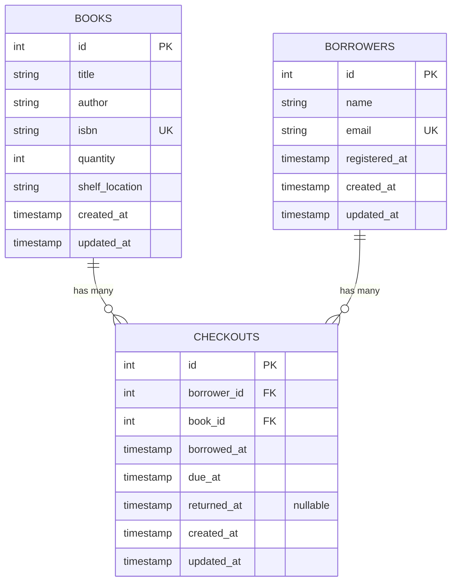

# Node.js Library System

A simple Library Management API built with **Node.js**, **Express**, and **MySQL**. Add, update, remove books as well as managing borrowers and their checkouts.

---

## Prerequisites

Before running this system, make sure you have the following installed:

- **Node.js** and **npm** - for running the application
- **Docker** and **Docker Compose** - for running the MySQL database

Verify installation by running:

```bash
node --version
npm --version
docker --version
docker-compose --version
```

---

## Getting Started

### 1) Install dependencies

```bash
npm install
```

### 2) Run MySQL + Adminer (Docker)

Start the database and admin UI:

```bash
docker-compose up -d
```

This starts:
- **MySQL** on port **3306**
- **Adminer** on port **8080** (http://localhost:8080)

#### Adminer login (default)

- **System**: MySQL
- **Server**: mysql
- **Username**: library_user
- **Password**: library_pass
- **Database**: library_system

### 3) Configure environment

Copy `.env.example` to `.env` and update if needed:

```bash
cp .env.example .env
```

### 4) Run migrations

```bash
npm run migrate
```

> Tip: If you need a clean schema, run:
>
> ```bash
> npm run reset-db
> ```

### 5) Start the server

```bash
npm start
```

The API will run at: http://localhost:3000


---

## Database Schema



---

## Helper scripts

| Script | What it does |
| ------ | ------------ |
| `npm run docker:up` | Start Docker services (MySQL + Adminer) |
| `npm run docker:down` | Stop Docker services |
| `npm run migrate` | Run database migrations |
| `npm run reset-db` | Roll back then re-run migrations (data will be lost) |
| `npm run setup` | Start Docker + run migrations |
| `npm run start:docker` | Run `setup` then start the server |
| `npm run smoke` | Run a basic healthcheck against http://localhost:3000 |
| `npm test` | Run all unit tests with Jest |
| `npm run test:watch` | Run tests in watch mode (re-run on file changes) |
| `npm run test:coverage` | Run tests and generate coverage report |

---

## API Endpoints

### Books

Base path: `/library/books`

#### 1. List All Books
**GET** `/library/books`

List all books in the library.

```bash
curl -X GET http://localhost:3000/library/books
```

**Response (200 OK):**
```json
[
  {
    "id": 1,
    "title": "The Great Gatsby",
    "author": "F. Scott Fitzgerald",
    "isbn": "978-0-7432-7356-5",
    "quantity": 5,
    "shelfLocation": "A1",
    "createdAt": "2024-01-01T10:00:00Z",
    "updatedAt": "2024-01-01T10:00:00Z"
  },
  {
    "id": 2,
    "title": "1984",
    "author": "George Orwell",
    "isbn": "978-0-451-52494-2",
    "quantity": 3,
    "shelfLocation": "B2",
    "createdAt": "2024-01-02T10:00:00Z",
    "updatedAt": "2024-01-02T10:00:00Z"
  }
]
```

#### 2. Get Book by ID
**GET** `/library/books/:id`

Retrieve details of a specific book.

```bash
curl -X GET http://localhost:3000/library/books/1
```

**Response (200 OK):**
```json
{
  "id": 1,
  "title": "The Great Gatsby",
  "author": "F. Scott Fitzgerald",
  "isbn": "978-0-7432-7356-5",
  "quantity": 5,
  "shelfLocation": "A1",
  "createdAt": "2024-01-01T10:00:00Z",
  "updatedAt": "2024-01-01T10:00:00Z"
}
```

**Error Response (404 Not Found):**
```json
{ "message": "Book not found" }
```

#### 3. Create Book (Protected)
**POST** `/library/books`

Add a new book to the library. Requires JWT token.

```bash
curl -X POST http://localhost:3000/library/books \
  -H "Content-Type: application/json" \
  -H "Authorization: Bearer YOUR_JWT_TOKEN" \
  -d '{
    "title": "Pride and Prejudice",
    "author": "Jane Austen",
    "isbn": "978-0-14-143951-8",
    "quantity": 4,
    "shelfLocation": "D4"
  }'
```

**Request Body:**
```json
{
  "title": "Pride and Prejudice",
  "author": "Jane Austen",
  "isbn": "978-0-14-143951-8",
  "quantity": 4,           (optional, defaults to 0)
  "shelfLocation": "D4"    (optional, defaults to empty string)
}
```

**Response (201 Created):**
```json
{
  "id": 10,
  "title": "Pride and Prejudice",
  "author": "Jane Austen",
  "isbn": "978-0-14-143951-8",
  "quantity": 4,
  "shelfLocation": "D4",
  "createdAt": "2024-01-04T10:00:00Z",
  "updatedAt": "2024-01-04T10:00:00Z"
}
```

**Error Responses:**
- `400` - Missing required fields (title, author, isbn)
- `401` - Unauthorized (missing/invalid token)
- `409` - ISBN already exists (duplicate)

#### 4. Update Book (Protected)
**PUT** `/library/books/:id`

Update book details. Requires JWT token.

```bash
curl -X PUT http://localhost:3000/library/books/1 \
  -H "Content-Type: application/json" \
  -H "Authorization: Bearer YOUR_JWT_TOKEN" \
  -d '{
    "quantity": 6,
    "shelfLocation": "A2"
  }'
```

**Request Body (all fields optional):**
```json
{
  "title": "Updated Title",
  "author": "Updated Author",
  "isbn": "978-0-NEW-ISBN-0",
  "quantity": 6,
  "shelfLocation": "A2"
}
```

**Response (200 OK):**
```json
{
  "id": 1,
  "title": "Updated Title",
  "author": "Updated Author",
  "isbn": "978-0-NEW-ISBN-0",
  "quantity": 6,
  "shelfLocation": "A2",
  "createdAt": "2024-01-01T10:00:00Z",
  "updatedAt": "2024-01-04T11:30:00Z"
}
```

**Error Responses:**
- `400` - No fields to update (empty request body)
- `401` - Unauthorized
- `404` - Book not found

#### 5. Delete Book (Protected)
**DELETE** `/library/books/:id`

Remove a book from the library. Requires JWT token.

```bash
curl -X DELETE http://localhost:3000/library/books/1 \
  -H "Authorization: Bearer YOUR_JWT_TOKEN"
```

**Response (204 No Content):**
No response body.

**Error Responses:**
- `401` - Unauthorized
- `404` - Book not found

---

### Borrowers

Base path: `/library/borrowers`

#### 1. List All Borrowers
**GET** `/library/borrowers`

List all borrowers in the system.

```bash
curl -X GET http://localhost:3000/library/borrowers
```

**Response (200 OK):**
```json
[
  {
    "id": 1,
    "name": "Alice Johnson",
    "email": "alice@example.com",
    "registeredAt": "2024-01-01T10:00:00Z",
    "createdAt": "2024-01-01T10:00:00Z",
    "updatedAt": "2024-01-01T10:00:00Z"
  },
  {
    "id": 2,
    "name": "Bob Smith",
    "email": "bob@example.com",
    "registeredAt": "2024-01-02T10:00:00Z",
    "createdAt": "2024-01-02T10:00:00Z",
    "updatedAt": "2024-01-02T10:00:00Z"
  }
]
```

#### 2. Get Borrower by ID
**GET** `/library/borrowers/:id`

Retrieve details of a specific borrower.

```bash
curl -X GET http://localhost:3000/library/borrowers/1
```

**Response (200 OK):**
```json
{
  "id": 1,
  "name": "Alice Johnson",
  "email": "alice@example.com",
  "registeredAt": "2024-01-01T10:00:00Z",
  "createdAt": "2024-01-01T10:00:00Z",
  "updatedAt": "2024-01-01T10:00:00Z"
}
```

**Error Response (404 Not Found):**
```json
{ "message": "Borrower not found" }
```

#### 3. Update Borrower (Protected)
**PUT** `/library/borrowers/:id`

Update borrower profile. Can only update own profile.

```bash
curl -X PUT http://localhost:3000/library/borrowers/1 \
  -H "Content-Type: application/json" \
  -H "Authorization: Bearer YOUR_JWT_TOKEN" \
  -d '{
    "name": "Alice Updated",
    "email": "alice.new@example.com"
  }'
```

**Request Body (all fields optional):**
```json
{
  "name": "Alice Updated",
  "email": "alice.new@example.com"
}
```

**Response (200 OK):**
```json
{
  "id": 1,
  "name": "Alice Updated",
  "email": "alice.new@example.com",
  "registeredAt": "2024-01-01T10:00:00Z",
  "createdAt": "2024-01-01T10:00:00Z",
  "updatedAt": "2024-01-04T11:30:00Z"
}
```

**Error Responses:**
- `400` - No fields to update
- `401` - Unauthorized
- `403` - Cannot update other borrower's profile
- `404` - Borrower not found

#### 4. Delete Borrower Account (Protected)
**DELETE** `/library/borrowers/:id`

Delete borrower account. Can only delete own account.

```bash
curl -X DELETE http://localhost:3000/library/borrowers/1 \
  -H "Authorization: Bearer YOUR_JWT_TOKEN"
```

**Response (204 No Content):**
No response body.

**Error Responses:**
- `401` - Unauthorized
- `403` - Cannot delete other borrower's account
- `404` - Borrower not found

---

### Checkouts and Returns

#### 1. Checkout Book (Protected)
**POST** `/library/borrowers/:id/checkout`

Borrow a book. Can only checkout for own account.

```bash
curl -X POST http://localhost:3000/library/borrowers/1/checkout \
  -H "Content-Type: application/json" \
  -H "Authorization: Bearer YOUR_JWT_TOKEN" \
  -d '{
    "bookId": 5,
    "dueDate": "2024-02-04"
  }'
```

**Request Body:**
```json
{
  "bookId": 5,
  "dueDate": "2024-02-04"  (optional, defaults to 14 days from now)
}
```

**Response (201 Created):**
```json
{
  "id": 1,
  "borrowerId": 1,
  "bookId": 5,
  "borrowedAt": "2024-01-04T10:00:00Z",
  "dueAt": "2024-02-04T10:00:00Z",
  "returnedAt": null,
  "createdAt": "2024-01-04T10:00:00Z",
  "updatedAt": "2024-01-04T10:00:00Z"
}
```

**Error Responses:**
- `400` - Missing required fields
- `401` - Unauthorized
- `403` - Cannot checkout for other borrower
- `404` - Book or borrower not found
- `409` - Book not available or already checked out

#### 2. Return Book (Protected)
**POST** `/library/borrowers/:id/return`

Return a borrowed book. Can only return for own account.

```bash
curl -X POST http://localhost:3000/library/borrowers/1/return \
  -H "Content-Type: application/json" \
  -H "Authorization: Bearer YOUR_JWT_TOKEN" \
  -d '{"bookId": 5}'
```

**Request Body:**
```json
{
  "bookId": 5
}
```

**Response (200 OK):**
```json
{
  "id": 1,
  "borrowerId": 1,
  "bookId": 5,
  "borrowedAt": "2024-01-04T10:00:00Z",
  "dueAt": "2024-02-04T10:00:00Z",
  "returnedAt": "2024-01-18T09:30:00Z",
  "createdAt": "2024-01-04T10:00:00Z",
  "updatedAt": "2024-01-18T09:30:00Z"
}
```

**Error Responses:**
- `400` - Missing bookId
- `401` - Unauthorized
- `403` - Cannot return for other borrower
- `404` - No active checkout found

#### 3. Get Borrower's Checkouts
**GET** `/library/borrowers/:id/checkouts`

View all checkouts for a borrower with optional filtering.

```bash
# Get all checkouts
curl -X GET http://localhost:3000/library/borrowers/1/checkouts

# Get only active checkouts
curl -X GET http://localhost:3000/library/borrowers/1/checkouts?active=true

# Get only overdue checkouts
curl -X GET http://localhost:3000/library/borrowers/1/checkouts?overdue=true
```

**Response (200 OK):**
```json
[
  {
    "id": 1,
    "borrowerId": 1,
    "bookId": 5,
    "borrowedAt": "2024-01-04T10:00:00Z",
    "dueAt": "2024-02-04T10:00:00Z",
    "returnedAt": null,
    "createdAt": "2024-01-04T10:00:00Z",
    "updatedAt": "2024-01-04T10:00:00Z"
  },
  {
    "id": 2,
    "borrowerId": 1,
    "bookId": 3,
    "borrowedAt": "2024-01-01T10:00:00Z",
    "dueAt": "2024-01-15T10:00:00Z",
    "returnedAt": "2024-01-18T09:30:00Z",
    "createdAt": "2024-01-01T10:00:00Z",
    "updatedAt": "2024-01-18T09:30:00Z"
  }
]
```

**Query Parameters:**
- `active=true` - Only show unreturned books
- `overdue=true` - Only show books past due date

**Error Response (404 Not Found):**
```json
{ "message": "Borrower not found" }
```

---

## Authentication & JWT

This API uses **JWT (JSON Web Tokens)** for secure authentication.

### How It Works

1. **Sign up** to create a new account and get a JWT token
2. **Login** with email to get a JWT token
3. **Include token** in the `Authorization` header for protected endpoints
4. **Token expires** after 7 days (configurable)

### Sign Up Endpoint

**POST** `/library/borrowers/auth/signup`

Register a new borrower account and receive JWT token in the response.

Request body:
```json
{
  "name": "John Doe",
  "email": "john.doe@example.com"
}
```

Response (201 Created):
```json
{
  "token": "eyJhbGciOiJIUzI1NiIsInR5cCI6IkpXVCJ9...",
  "borrower": {
    "id": 1,
    "name": "John Doe",
    "email": "john.doe@example.com"
  }
}
```

**Error Responses:**
- `400` - Missing name or email
- `409` - Email already registered

### Login Endpoint

**POST** `/library/borrowers/auth/login`

Log in with email to get a JWT token.

Request body:
```json
{
  "email": "john.doe@example.com"
}
```

Response (200 OK):
```json
{
  "token": "eyJhbGciOiJIUzI1NiIsInR5cCI6IkpXVCJ9...",
  "borrower": {
    "id": 1,
    "name": "John Doe",
    "email": "john.doe@example.com"
  }
}
```

**Error Responses:**
- `400` - Missing email
- `401` - Email not found or invalid credentials

### Using the Token

Include the token in the Authorization header for all protected endpoints:

```bash
curl -X PUT http://localhost:3000/library/borrowers/1 \
  -H "Content-Type: application/json" \
  -H "Authorization: Bearer YOUR_JWT_TOKEN" \
  -d '{"name": "Jane Doe"}'
```

### Environment Configuration

Add these optional variables to `.env`:

```bash
# JWT Configuration
JWT_SECRET=secret-key
JWT_EXPIRY=7d
```

## Architecture & Technology Stack

### Architecture Overview

This project follows a **3-layer architecture** pattern:

```
Client Request
    ↓
Routes (Controllers) [src/routes/]
    ↓
Validation & Middleware [src/facade/]
    ↓
Repository Layer [src/repository/]
    ↓
Database (MySQL)
    ↓
Error Handler [src/facade/errorHandler.js]
```

### Technology Stack

- Node.js 
- Express.js 
- MySQL
- Knex.js 
- jsonwebtoken
- Docker Compose - containerized MySQL

### Best Practices Implemented

- **JWT Authentication**: Stateless token-based authentication using `jsonwebtoken` library
- **Authorization Middleware**: Protected endpoints require valid JWT tokens in Authorization header
- **Access Control**: Users can only modify their own data (borrowers cannot access other borrowers' accounts)
- **Parameterized Queries**: All database queries use Knex builder, preventing SQL injection
- **Input Validation**: Request bodies validated before processing

